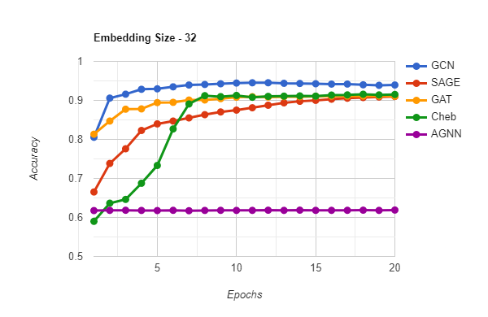

# GNN - Term Project

## Folders

1. `analysis/` contains all graphs for analysis purpose.
2. `data/` contains the dataset
3. `link_prediction` contains the dot predictor (a link prediction function)
4. `models` contains the list of models implemented (GCN, GraphSAGE, GAT, Chebyshev, Attention based GNN)
5. `main.py` the start point of execution
6. `recommendation.py` predicts the recommendations for a specific user
7. `results.txt` contains all the results prodcued for analysis
8. `train.py` trains different models
9. `visualize.py` helps with visualization of graph.

## Executing the program

1. Use the following command to install all the required libraries
   To create an environment
   ```
   python -m venv venv
   ```
   
   To activate the environment
   ```
   source venv/Scripts/activate
   ```
   
   To install the libraries
   ```
   pip install -r requirements.txt
   ```

2. Use the following command to see the list of available arguments.
   ```
   python main.py --help
   ```

3. Sample command to run GCN model
   ```
   python main.py --model GCN --epochs 100 --lr 0.01 --embed_dim 16
   ```
   Models: GCN/SAGE/GAT/CHEB/AGNN

## Analysis

### Accuracies of models over different embedding sizes


### Accuracies comparison of different models over embedding sizes





### Accuracies of models over epochs on different embedding sizes


### Loss of models over epoch on different embedding sizes


